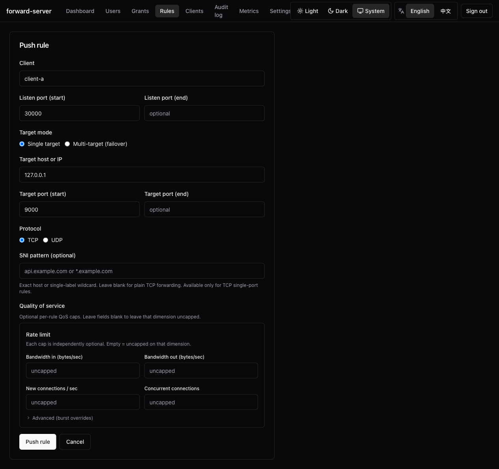
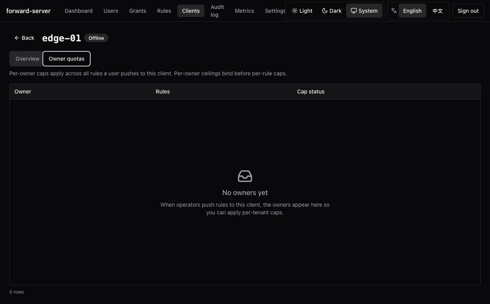

Available since v0.11.0. Each cap is **independently optional**; absent
fields preserve v0.10 behaviour byte-for-byte.

## Cap kinds

| Cap | Effect when exceeded |
| --- | --- |
| `bandwidth_in_bps` | Token-bucket throttle on inbound copy half. **Connection is never closed** — the read half parks until the next refill. |
| `bandwidth_out_bps` | Same, outbound half. Each direction has its own throttle wall-clock counter. |
| `new_connections_per_sec` | TCP accept-then-RST or UDP first-packet drop. |
| `concurrent_connections` | Atomic `fetch_add` then cap check on accept (TCP) / first-packet (UDP). RAII guard releases the slot on close. |

`bandwidth_in_bps`, `bandwidth_out_bps`, and `new_connections_per_sec`
each accept an optional burst override; `concurrent_connections` does
not (it has no token bucket). Absent → `burst = 1 × rate` (one second of
tokens). Server validation clamps the burst to `[rate / 100, rate × 60]`
and rejects zero rates.

<Callout type="info">
  **The rate limiter never closes existing connections** — including
  under hot-reload that lowers a concurrent cap below the live count.
  A lower cap drains gracefully; new connections are rejected against
  the new ceiling.
</Callout>

## Interaction with the splice fast path

The Linux TCP zero-copy fast path added in v1.3.0 is decided **per
connection** at accept time. The predicate is exactly:

```text
splice runs  ⇔  Linux  &&  TCP  &&  !PORTUNUS_DISABLE_SPLICE
              &&  rule has no  bandwidth_in_bps / bandwidth_out_bps
              &&  owner has no bandwidth_in_bps / bandwidth_out_bps
```

In plain terms:

| Rule shape | Data path | Reason |
| --- | --- | --- |
| No bandwidth cap on rule **and** no bandwidth cap on owner | splice fast path | Nothing to shape; kernel pipe is byte-perfect. |
| Any bandwidth cap (rule or owner, in or out direction) | userspace path | Token-bucket shaper, byte-identical to v1.2.0. |

Important consequences:

- **`new_connections_per_sec` and `concurrent_connections` do NOT
  disable splice.** They are accept-time gates that run **before** the
  data path is chosen — they reject or admit a connection, but they do
  not shape its bytes. A rule with `concurrent_connections = 1000` and
  no bandwidth cap still uses splice for the data plane.
- Mixing capped and uncapped rules on the same server is fine — each
  connection picks its own path independently.
- Hot-reload that adds or removes a bandwidth cap only affects **new**
  connections. Existing connections keep their original path until
  they close.
- splice is TCP-only and Linux-only. UDP rules and non-Linux hosts
  always use the userspace path; caps apply identically.
- All cap metrics, audit fields, throttle counters, and reject behavior
  are unchanged by splice. See [Metrics](#metrics).

Enabling splice never disables a QoS feature: capped rules skip the
speedup, uncapped rules get it.

## Per-rule caps

```sh
portunus-server push-rule edge-01 443 backend.local:8080 \
  --bandwidth-in-bps 1048576 \           # 1 MB/s in
  --bandwidth-out-bps 524288 \           # 512 KB/s out
  --new-connections-per-sec 100 \
  --concurrent-connections 1000 \
  --bandwidth-in-burst 2097152           # optional burst override
```

Burst flags are `--bandwidth-in-burst`, `--bandwidth-out-burst`, and
`--new-connections-burst`.

The `list-rules` human output gains a compact `CAPS` column showing
the active caps per rule.

## Per-owner ceilings

A per-owner ceiling caps the **aggregate** across every rule owned by
that user on a given client. The envelope is keyed `(client, owner)`.

Per-owner caps **bind before** per-rule caps — rejects carry distinct
`owner_*` reasons.

```sh
# Set Alice's envelope on edge-01
portunus-server owner-cap set edge-01 alice \
  --bandwidth-in-bps 10485760 \         # 10 MB/s aggregate
  --concurrent-connections 5000

# Inspect
portunus-server owner-cap get edge-01 alice
portunus-server owner-cap list edge-01

# Remove
portunus-server owner-cap delete edge-01 alice
```

REST surface: `/v1/clients/{client_id}/owners/{owner_id}/rate-limit`
(list owners at `/v1/clients/{client_id}/owners`).

## Reject reasons

Six values surface on `portunus_rate_limit_reject_total{reason=…}`:

- `conn_concurrent`
- `conn_rate`
- `udp_flow_rate`
- `owner_concurrent`
- `owner_conn_rate`
- `owner_udp_flow_rate`

The `owner` label is **empty** for per-rule rejects and **populated**
for owner-scoped rejects.

## Hot-reload

Cap mutations swap the rule's `Arc<RuleRateLimiter>` while preserving
`tokens` and `last_refill_micros` carryover, so:

- Raising the cap doesn't mint a free burst.
- Lowering the cap doesn't strand the existing token pool.
- Lowering the concurrent cap below the live count drains gracefully —
  no forcible close (FR Q4).

Since v1.7.0, a rule's per-rule limiter is reclaimed when the rule is
removed (previously it leaked).

## Capability gate

Pushing `rate_limit` (or any owner-cap mutation) to a v0.10-or-earlier
client returns HTTP 422 `rate_limit_unsupported_by_client` before any
rule activates anywhere.

## Reject path: TCP accept-then-RST

Portunus **does not pause the listener** on a capped rule, because
v0.7 / v0.9 share listeners across rules — pausing would penalise
sibling rules. Instead, capped rejects accept the connection, mark it
with `SO_LINGER {l_onoff: 1, l_linger: 0}`, and close, producing a
clean RST visible to the client.

## Metrics

```
portunus_rate_limit_reject_total{client,rule,owner,reason}
portunus_rate_limit_throttle_seconds_total{client,rule,owner,direction}
portunus_rate_limit_active_connections{client,rule,owner}
```

Data-plane reject and throttle events are **tracing-only** — they do
**not** enter the SQLite operator audit ring (mirrors the v0.9 D13
invariant).

## Web UI

The rule editor gains a "Quality of service" section (cap inputs,
burst overrides folded behind an "Advanced" disclosure). The rules
table gains a compact `Caps` column. The client detail page gains an
`Owner quotas` tab where superadmins manage per-owner envelopes.




