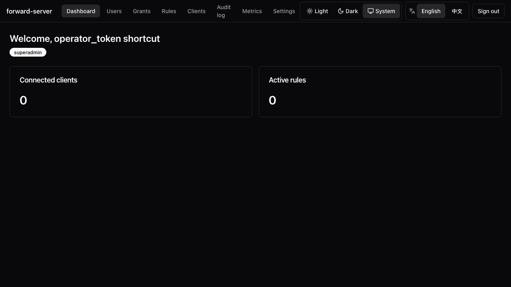
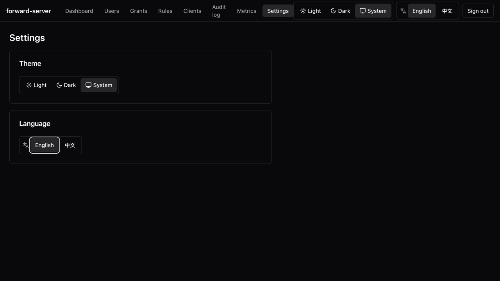

Available since v0.6.0. The UI is embedded into `portunus-server` via
`rust-embed` and served at the existing operator HTTP listener's root
path `/`. **There is no runtime Node dependency on the deployment host.**

## Open it

`portunus-server` ships with the SPA bundled. Open the operator HTTP
listener address in a modern browser:

```
http://127.0.0.1:7080/
```

Supported browsers: Chrome / Firefox / Safari / Edge — latest two
releases.

## Login

Since v1.1.0 the Web UI uses local user ID + password login. On first
startup, before any active `superadmin` exists, the server prints a setup
token to stderr and stores only its hash in SQLite. Open the Web UI, enter
that setup token, and create the first `superadmin` account.

- The setup token expires after 30 minutes.
- If onboarding is not completed, each server process start rotates the setup
  token and invalidates the previous one.
- Web login creates an `HttpOnly` `portunus_session` cookie. The SPA does not
  store login secrets in `sessionStorage` or `localStorage`.
- Admins create users manually and may set an initial password. Self-service
  public registration is intentionally not supported.

Machines authenticate with the static `operator_token`
([`gen-token`](/en/docs/server-client/configuration/server) → `server.toml`,
sourced via `PORTUNUS_OPERATOR_TOKEN`); humans use Web cookie login. The two are
separate mechanisms.

## What you get



| Section | Notes |
| --- | --- |
| **Dashboard** | Connected clients, active rules, top metrics |
| **Users** | (superadmin) Add/list users; track grants |
| **Grants** | (superadmin) RBAC grant management |
| **Rules** | Push, list, remove. Per-rule live stats over SSE (5 s cadence; falls back to polling if SSE blocked) |
| **Clients** | List and inspect connected `portunus-client` instances |
| **Audit log** | (superadmin) Filter by outcome, paginate via cursor, export NDJSON |
| **Metrics** | (superadmin) Raw `/metrics` payload behind RBAC |
| **Settings** | Theme + language toggles |

## Per-rule live stats

The rule detail page subscribes to
`GET /v1/rules/{id}/stats/stream` — an SSE channel that pushes one
`RuleStatsSnapshot` per stats-report tick (default 5 s,
`stats_report_interval_secs`). A fresh subscriber gets the cache's
current snapshot immediately, then live fan-out from a per-rule
`tokio::sync::broadcast`, so cost is `O(rules)`, not
`O(rules × subscribers)`. A 30 s keep-alive comment holds the
connection open through middleboxes. Slow consumers that fall behind the
broadcast buffer drop snapshots (`Lagged`) and a `stats_stream.lagged`
warning is logged.

## Multi-target rules

The rule detail Targets section shows health badges (Healthy /
Degraded / Failed), last-failure / last-success timestamps, and
per-target byte counters that update on the SSE cadence.

## Rate limiting & QoS

The rule editor gains a "Quality of service" section. Burst overrides
are folded behind an "Advanced" disclosure. The rules table gains a
compact `Caps` column. The client detail page gains an `Owner quotas`
tab for managing per-owner envelopes.


## Themes & i18n

- **Themes**: light / dark / `prefers-color-scheme`.
- **Languages**: English + 简体中文 (toggle in Settings; remembered
  across reloads).

A coverage unit test fails CI if a translation key drifts between
bundles.



## Bind address

The operator HTTP listener defaults to loopback. For containers or trusted
reverse proxies, set `operator_http_listen = "0.0.0.0:7080"` and publish the
port intentionally. Remote access stays an operator concern:

- **SSH-tunnel** `127.0.0.1:7080` from your workstation, or
- Sit the listener behind a **reverse proxy** that adds its own auth.

## Secret-leak safeguards

- Web login secrets are never written to browser storage.
- Session cookies are `HttpOnly`, `SameSite=Lax`, and `Secure` when TLS is
  enabled.
- Temporary passwords are shown only in one-time reveal dialogs and are never
  placed in URLs.

## Password recovery

Normal users do not self-reset through a public "forgot password" flow. A
`superadmin` resets the password from the user detail page. The reset revokes
the user's active Web sessions.

If the last `superadmin` forgets the password, recovery is local-only. Use the
actual superadmin user ID (`_superadmin` for `bootstrap-superadmin`, or the ID
chosen during Web onboarding):

```sh
portunus-server --data-dir /var/lib/portunus reset-password admin --temporary
```

The command prints a temporary password once and marks the account as requiring
a password change. There is no remote backdoor reset endpoint.

## Build

The SPA lives at `webui/`. Release pipelines run:

```sh
cd webui
pnpm install --frozen-lockfile
pnpm build      # vite build + size-limit gate (gzipped ≤ 500 KB)
cd ..
cargo build --release -p portunus-server
```

Backend-only iteration:

```sh
PORTUNUS_SKIP_WEBUI=1 cargo build -p portunus-server
# Compiles a UI-less stub so rust-embed always has something to embed.
```

Release pipelines never set this env var.
