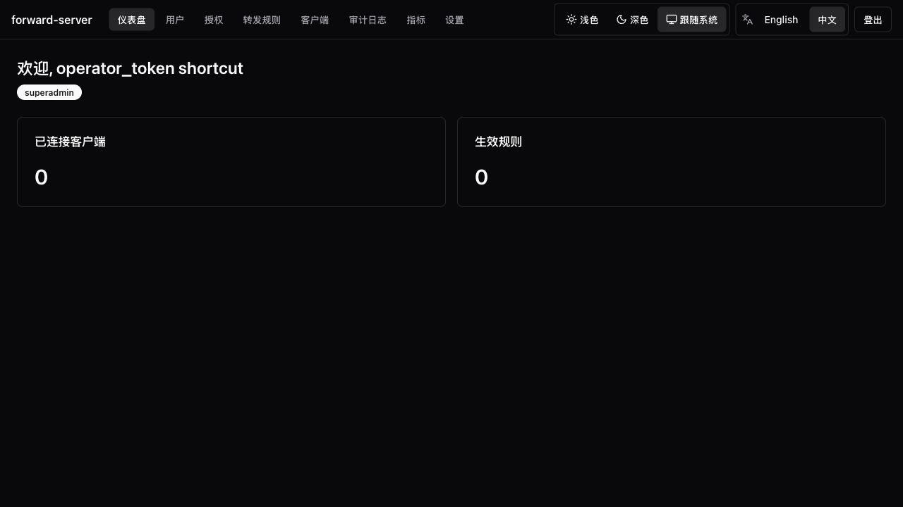
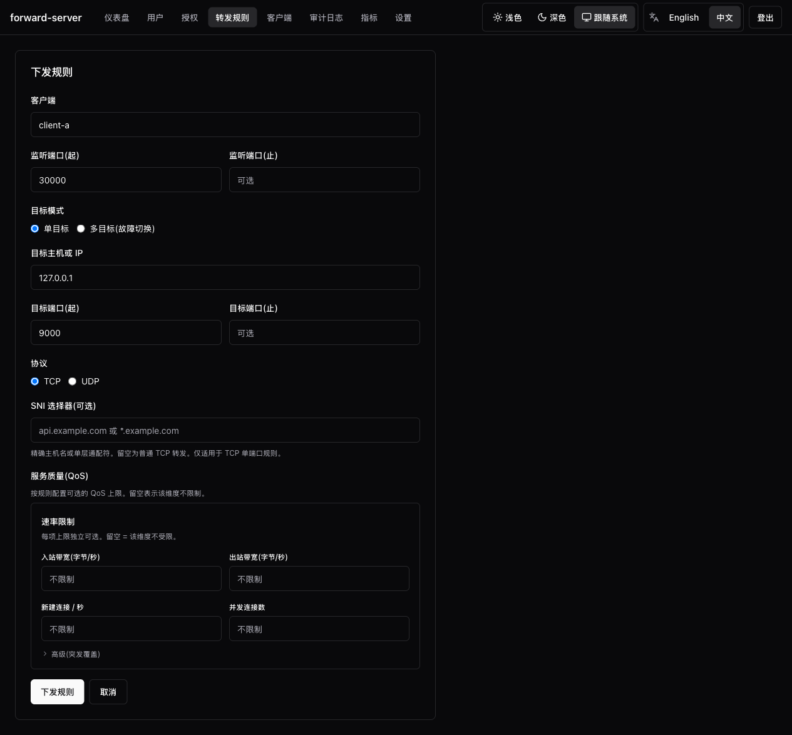
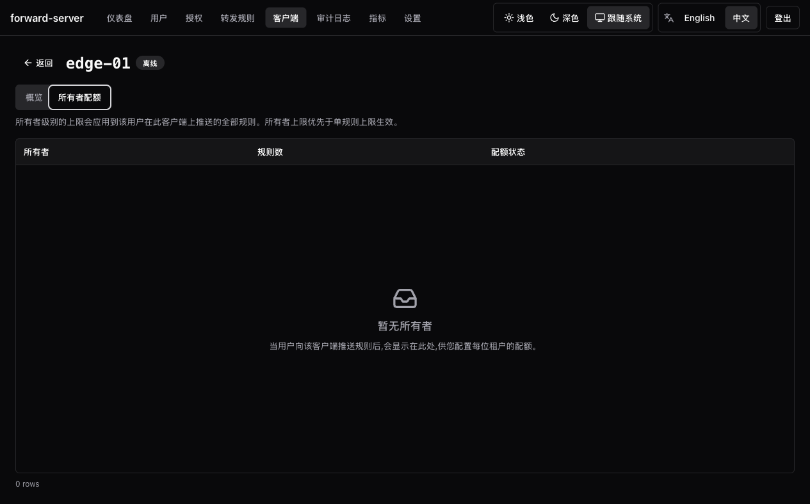
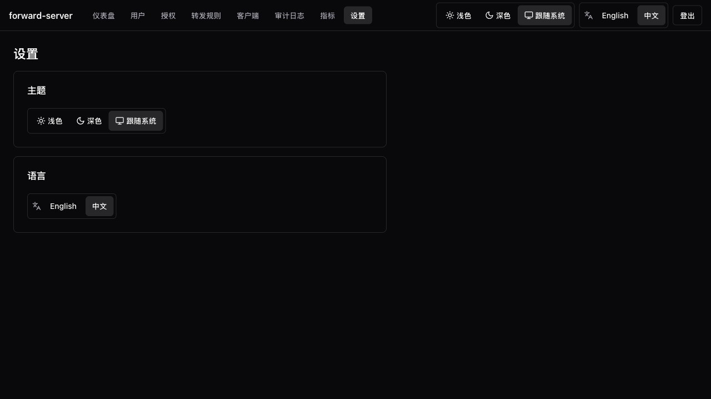

v0.6.0 起支持。UI 通过 `rust-embed` 嵌入到 `portunus-server`，从现有的操作员
HTTP listener 的根路径 `/` 提供。**部署主机上不需要任何 Node 运行时。**

## 打开

`portunus-server` 已经把 SPA 打包好了。在浏览器里打开操作员 HTTP listener
的地址即可：

```
http://127.0.0.1:7080/
```

支持的浏览器：Chrome / Firefox / Safari / Edge —— 最新两个版本。

## 登录

登录页要求输入操作员 Bearer Token。粘贴并 "Sign in"。

- Token 仅存于 `sessionStorage`，浏览器关闭即清空。
- **绝不** 写入 `localStorage` 或 cookie。
- 每条 `/v1/*` 请求都走与 CLI 相同的 `auth_layer` 中间件。

## 你能做什么



| 区块 | 说明 |
| --- | --- |
| **Dashboard** | 在线 Client 数、活跃规则数、关键指标 |
| **Users** | （超管）添加 / 列出用户；签发凭据；查看 Grant |
| **Credentials** | 当前用户自助旋转 |
| **Grants** | （超管）RBAC Grant 管理 |
| **Rules** | push / list / remove。逐规则实时统计走 SSE（5 秒节奏；SSE 被拦时回退到轮询） |
| **Clients** | 列出与检视已连接的 `portunus-client` 实例 |
| **Audit log** | （超管）按 outcome 过滤，cursor 翻页，导出 NDJSON |
| **Metrics** | （超管）RBAC 守门后的原始 `/metrics` |
| **Settings** | 主题与语言切换 |

## 逐规则实时统计

规则详情页订阅 `GET /v1/rules/{id}/stats/stream` —— 一个每 5 秒推送一个
`RuleStatsSnapshot` 的 SSE 通道。订阅成本是 `O(规则数)` 而非
`O(规则 × 订阅者)`。慢消费者会收到 `Lagged`，每条规则每分钟最多打印一次。

## 多目标规则

规则详情的 Targets 区块展示健康徽标（Healthy / Degraded / Failed）、
最近一次失败 / 成功的时间戳，以及在 SSE 节奏下更新的逐目标字节计数。

## 限流与 QoS

规则编辑器多出一节 "Quality of service"。Burst 覆写默认折叠在 "Advanced"
下。规则列表多出一列紧凑的 `Caps`。Client 详情页多出一个 `Owner quotas`
标签，用于管理每个所有者的信封。





## 主题与 i18n

- **主题**：light / dark / `prefers-color-scheme`。
- **语言**：English + 简体中文（在 Settings 中切换；跨刷新记忆）。

CI 中有覆盖率单元测试 —— 翻译键在两个语言包之间不一致就会失败。



## 默认 loopback

操作员 HTTP listener 在启动时被钉在 loopback。远程访问由操作员负责：

- 从工作站 **SSH 隧道** 到 `127.0.0.1:7080`，或
- 把 listener 放在带自有认证的 **反向代理** 后面。

## 防 Token 泄漏

- 仅 `sessionStorage` —— 永不进 `localStorage` / cookie。
- Bearer 永不出现在 URL、查询串或 `Referer` 头里。
- Bearer 永不进入 DOM（审计 checklist 验证：搜索 Bearer 前 8 个字符为 0 命中）。

## 构建

SPA 位于 `webui/`。Release 流水线执行：

```sh
cd webui
pnpm install --frozen-lockfile
pnpm build      # vite build + size-limit 守门（gzip ≤ 500 KB）
cd ..
cargo build --release -p portunus-server
```

仅迭代后端时：

```sh
PORTUNUS_SKIP_WEBUI=1 cargo build -p portunus-server
# 编译出 stub UI，让 rust-embed 始终有东西可嵌入。
```

Release 流水线绝不设置该 env。
